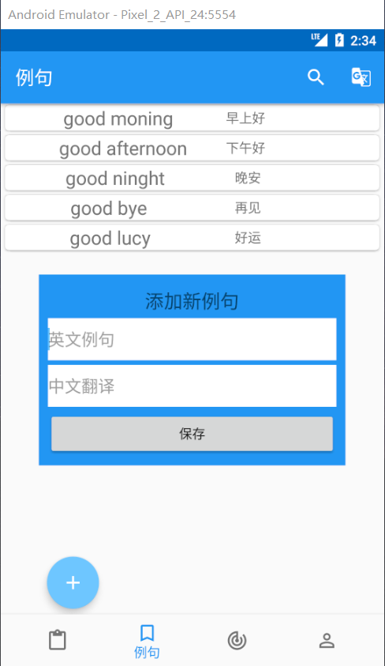
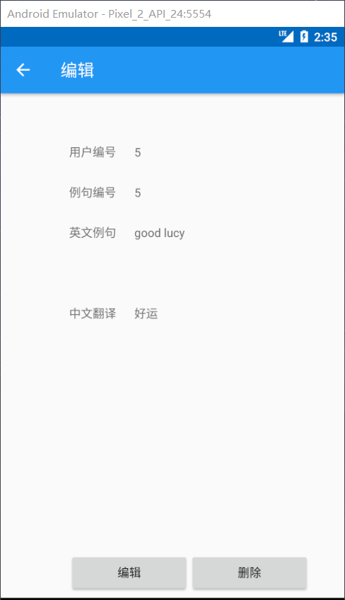
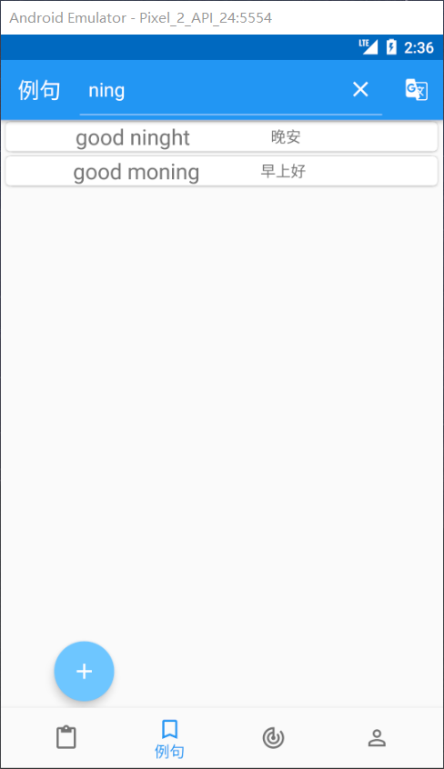
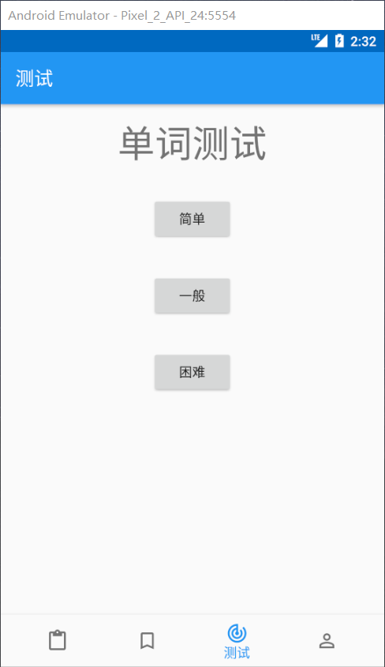
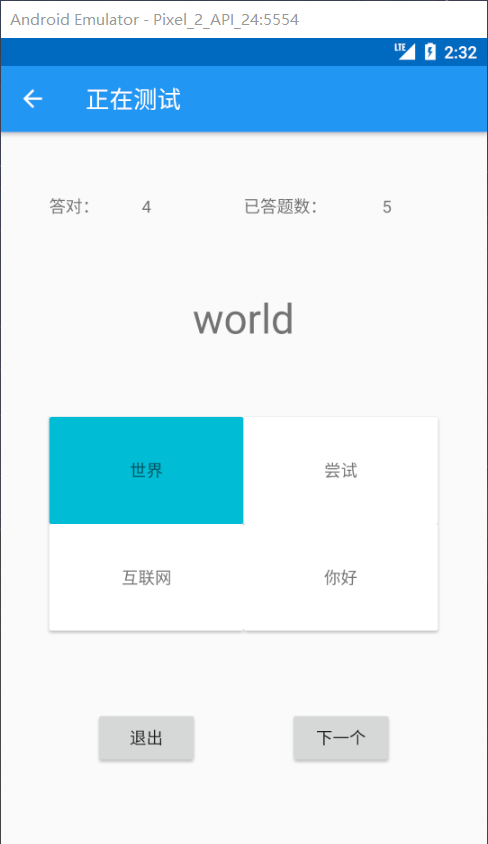
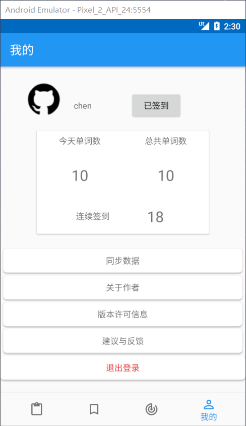

# “英语学习助手”客户端APP

### 程序说明

请确保服务端正常运行！客户端才能使用！

由于时间仓促、该客户端网络这块BUG较多


### 运行截图

**登录注册模块**（UI借鉴[LoginLikeQQ](https://github.com/bflyff/LoginLikeQQ)）

 

**单词模块**

  

**例句模块**

   

**翻译模块**


**测试模块**

 

**个人中心模块**




### 依赖项

```
    def room_version = '2.2.5'
    implementation "androidx.room:room-runtime:$room_version"
    annotationProcessor "androidx.room:room-compiler:$room_version"

    def lifecycle_version = "2.1.0"
    implementation "androidx.lifecycle:lifecycle-extensions:2.2.0"
    implementation 'com.android.support.constraint:constraint-layout:1.1.3'

    implementation 'com.google.code.gson:gson:2.8.6'
    implementation 'com.squareup.okhttp3:okhttp:4.6.0'
```

